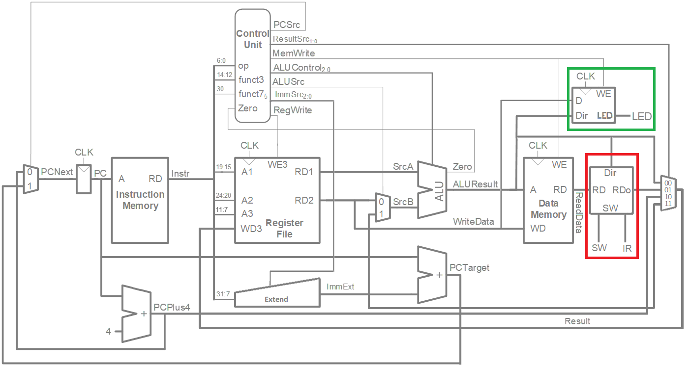
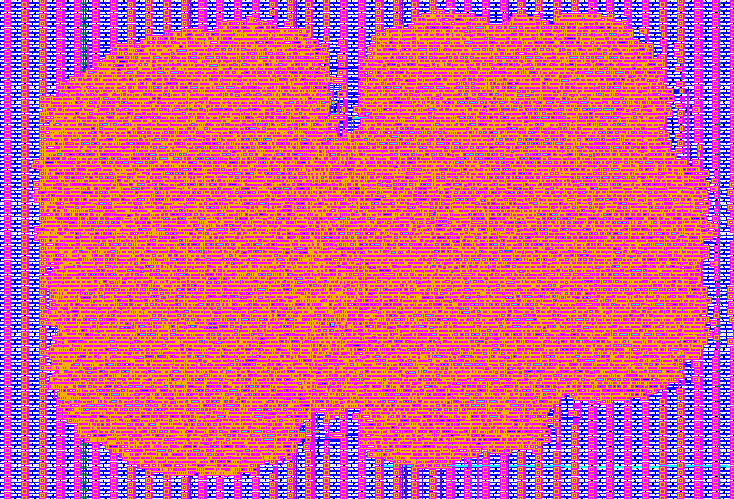

# Single Cycle RISC-V in OpenLane

## Project Description:

Implementation of a digital flow using OpenLane for a **Single Cycle RISC-V** processor with support for basic operations such as add, addi, jal, lui, etc. Additionally, the design includes three peripherals: a switch/button, an LED, and an on/off IR sensor.

The schematic used for this project is depicted in the following image, adapted from the book [*'Digital Design and Computer Architecture RISC-V Edition'*](https://pages.hmc.edu/harris/ddca/ddcarv.html) by Harris & Harris.

The latter design was created by [Nicolás Orcasitas](https://github.com/NicolasOrcasitas) and [Jorge Angarita](https://github.com/Gior-gio) for the subject '**Computer Architecture**' during the 2023-I semester at **UIS**.

## Final Result in KLayout:

This was generated using a series of .yaml files adapted from the [**Tiny Tapeout 5**](https://github.com/TinyTapeout/tt05-submission-template) and [**10 editions**](https://github.com/TinyTapeout/tt10-verilog-template) repositories by Uri Shaked, Matt Venn, and others. 

